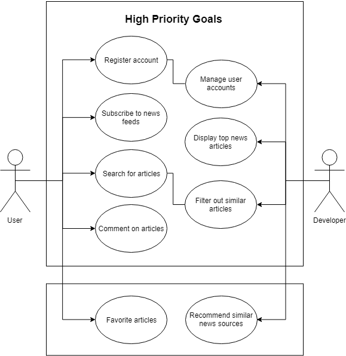

# Requirements

## Stakeholder Interviews
### Stakeholder/Investor Questions
* What is your top concern with the proposal?
* How often are you looking to meet and check in with us?
* How would you like to be updated on project progress?
* Have you seen other proposals/applications similar to this one and if so what advice can you give so that we can competitively differentiate ourselves?
* Are there other stakeholders you would recommend us contact?

### User Questions
* What are your pain points when trying to read news online today? 
* What are the news websites that you visit most frequently?
* Do you typically read multiple news websites in a single session?
* Are there specific sections you focus on?
* How would you prioritize these features?
	* search functionality
	* filter functionality
	* summarize top articles with a descriptive blurb
	* filter out duplicate articles
	* ability to choose from which sites to aggregate news
	* display headlines of top news articles
	* modern GUI

## End-user Observation
### Persona 1: College Student
Todd Johnson is a college freshman at New York University. He wants to stay up to date with the latest global news and be cognizant of what is going on outside of the campus bubble. He feels it extremely important to be well-versed in political knowledge and current news in order to be able to maintain mature conversations/debates with his peers. His primary medium of news consumption is an iPhone, and he reaches for the NYT, WSJ, and Apple News apps. An avid sports fan, Todd prefers to use the ESPN app for all sports news.

**Pain Points**
* There is so much content that is published, making it increasingly difficult to sift through the articles and identify what is truly worth reading. For instance, a lot of headlines have to do with Trump this, Trump that – but it's difficult to determine which stories are truly relevant and unbiased?
* Once a key article is found, it is often multiple paragraphs long and takes a long time to read and absorb; writing is often dry and overly didactic, resulting in difficult-to-follow news pieces whose numerous details obfuscate the main topic of the headline.
	* During the time spent reading a long news story, Todd may inevitably become distracted by a notification popup on his phone.
* The “filter” functionality in Apple News still yields a seemingly endless stream of content, much of which is irrelevant to Todd. This ranges from pop culture content to cooking recipes.

**Key Features to Solve Pain Points**
* Algorithms could identify the trending topics across a variety of news sources and generate a “top 5” list of trending news in multiple categories specifically selected by the user, such as politics, global news, and domestic US news. 
* The “top 5” headlines lists would be displayed in a compact form on a distraction-less, modern GUI, such that the user has can easily view data at a glance without having to scroll or click multiple buttons.
* An algorithm that traverses the selected “top 5” articles and generates a short (3-5 bullets) descriptive blurb summarizing the content of each target article.

### Persona 2: Venture Capital Analyst
Jeffrey Bearden is an analyst at Hercules Capital, a venture debt lending company. His major tasks involve business development and due diligence research. He spends a lot of time scouring various news sites, researching prospective companies. The news information is extremely important and helpful in identifying companies to invest in as well as identifying the most optimal time the company should be approached. Some of his major sources include finsmes.com, pitchbook.com, and fortune.com.

**Pain Points**
* Switching between different news sources is time consuming, unorganized, and not user friendly
	* Each site has different navigation paths to articles 
	* Sites vary in filter/search capabilities
* Often seeing the same story again and again across different news sites
	* Reading through entire articles only to reiterate the same information
* No aggregate search function to search across sites 

**Key Features to Solve Pain Points**
* Allowing the user to choose which sites to aggregate news information from
* Condense and streamline information by filtering duplicate stories
* Granular search functionality 
	* Search by funding round
	* Search by current investors
	* Sort by subject - IPO/PE/Acquisition

## Use Cases

1. **Title:** Register account
    - **Actor:** User
    - **Scenario:** The user registers new account with a username and password, and can log in to see personal news feed subscriptions.

2. **Title:** Subscribe to news feeds
    - **Actor:** User
    - **Scenario:** The user can choose from existing suggested news feeds, or enter their own news sources with feeds. These feeds are all visible to the user separated by category/genre. The user can view the articles from each feed. 

3. **Title:** Search for articles
    - **Actor:** User
    - **Scenario:** The user can search for articles in their news feeds by keyword or subject, and then view them 
    
4. **Title:** Comment on articles
    - **Actor:** User
    - **Scenario:** The user can comment on articles after reading them.
    
5. **Title:** Manage user accounts
    - **Actor:** Developer
    - **Scenario:** The developer stores the unique user accounts and their news feed subscriptions.
    
6. **Title:** Display top news articles
    - **Actor:** Developer
    - **Scenario:** The developer displays trending news articles to the user. These trending news articles are summarized with a descriptive blurb.

7. **Title:** Filter out similar articles
    - **Actor:** Developer
    - **Scenario:** The developer filters out articles with very similar content when the user searches for articles.

8. **Title:** Favorite articles
    - **Actor:** User
    - **Scenario:** The user can favorite articles that they like and view them later. 
    
9. **Title:** Recommend similar news sources
    - **Actor:** Developer
    - **Scenario:** The developer uses data from the user’s favorites and subscriptions to recommend similar news feeds to them.

## Domain Modeling

